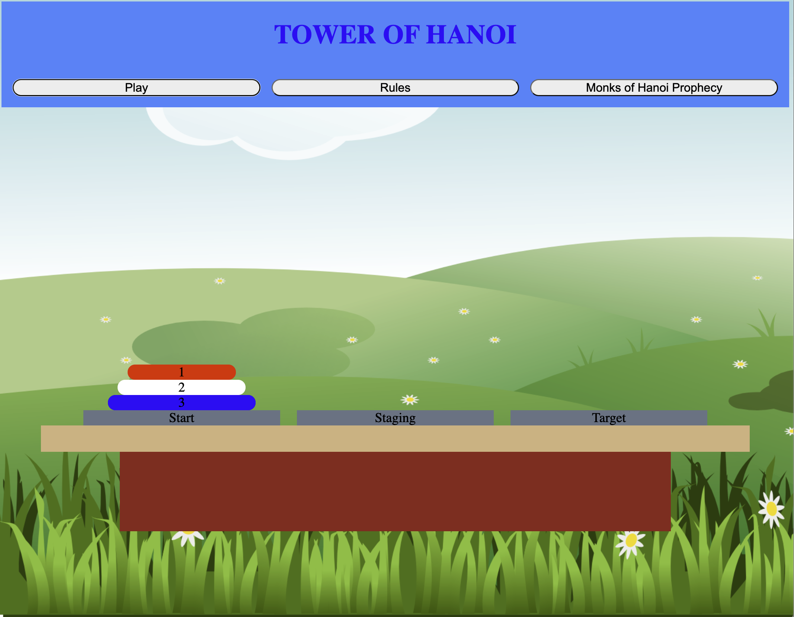
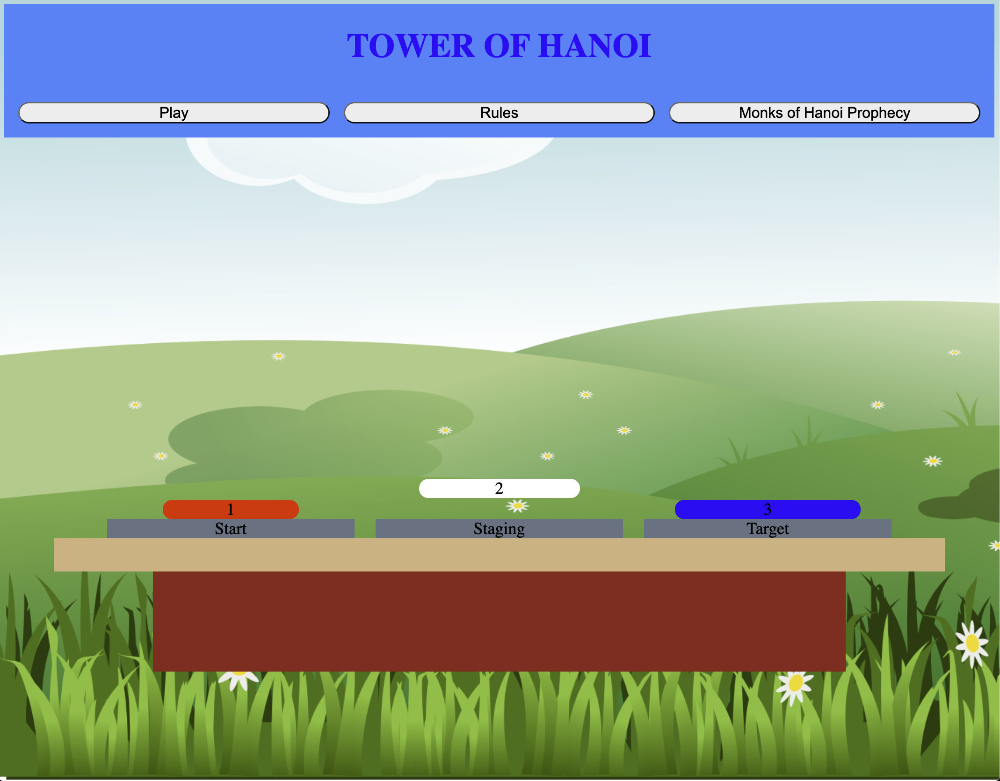
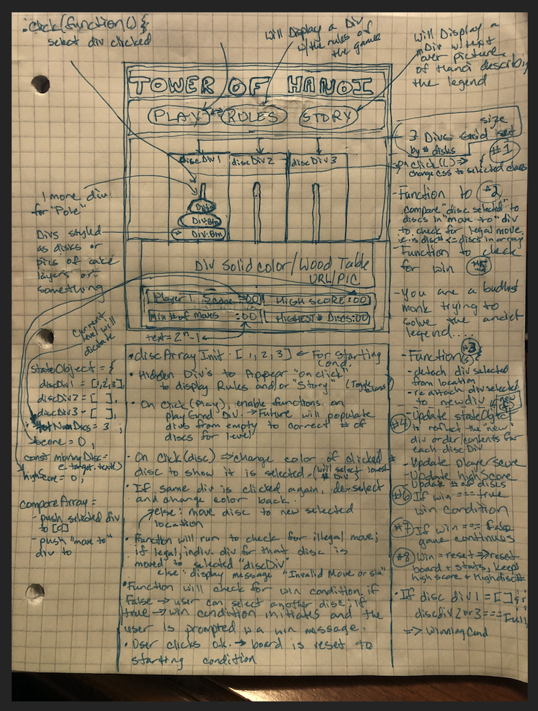

<!--
*** Thanks for checking out the Best-README-Template. If you have a suggestion
*** that would make this better, please fork the repo and create a pull request
*** or simply open an issue with the tag "enhancement".
*** Don't forget to give the project a star!
*** Thanks again! Now go create something AMAZING! :D
-->

<!-- PROJECT SHIELDS -->
<!--
*** I'm using markdown "reference style" links for readability.
*** Reference links are enclosed in brackets [ ] instead of parentheses ( ).
*** See the bottom of this document for the declaration of the reference variables
*** for contributors-url, forks-url, etc. This is an optional, concise syntax you may use.
*** https://www.markdownguide.org/basic-syntax/#reference-style-links
-->
[![Contributors][contributors-shield]][contributors-url]
[![Forks][forks-shield]][forks-url]
[![Stargazers][stars-shield]][stars-url]
[![Issues][issues-shield]][issues-url]
[![MIT License][license-shield]][license-url]
[![LinkedIn][linkedin-shield]][linkedin-url]

<!-- PROJECT LOGO -->
 

  

  <h3 align="center">Justin Herpin's Towers of Hanoi</h3>

  

    GA seirFlex-928 Project #1
     
    <a href="https://justindherpin.github.io/Project_1_Tower-of-Hanoi/OG/index.html"><strong>Play Towers of Hanoi Now</strong></a>
     
     
    <a href="https://www.linkedin.com/in/justin-herpin-ba5a8a217/">My Linked In</a>
    ·
    <a href="https://github.com/JustinDHerpin?tab=repositories">My Personal GitHub Repositories</a>
    ·
    <a href="https://github.com/JustinDHerpin/Project_1_Tower-of-Hanoi">This Project's Repository</a>
  

<!-- ABOUT THE PROJECT -->
## About The Project

This game is my take on the classic game of Tower of Hanoi.  This famous game evolved from a French methematician in 1883.

The user must move each disc, one by one, stacking only ontop of larger discs or empty blocks until the Target block mirrors the Starting Block.

Once the discs have all been moved, the round is over (and the next round should begin for future editions).

(<a href="#top">back to top</a>)

### Technologies Utilized:

* HTML
* CSS
* [JavaScript](https://www.javascript.com/)
* [JQuery](https://jquery.com)

### Frequented References:

* [W3Schools](https://www.w3schools.com/)
* [MDN Web Docs](https://developer.mozilla.org/en-US/)
* [Google](https://www.google.com/)
* [YouTube](https://www.youtube.com/)
* [Pixabay - royalty free pictures](https://pixabay.com/)
* [Jquery Documentation](https://api.jquery.com/click/)

(<a href="#top">back to top</a>)

<!-- GETTING STARTED -->
## How To Play

* All you need is an internet connection and capable device

* No installation required

* [Click Here to Play](https://justindherpin.github.io/Project_1_Tower-of-Hanoi/OG/index.html)

(<a href="#top">back to top</a>)

<!-- LICENSE -->
## User Stories and Stretch Goals

MVP Goals (3-5 days):
* As a player, I would like to have an attractive UI board displaying all elements of the game
* As a player, I would like to be able to learn the rules of the game.
* As a player, I would like to be able to start the game
* As a player, I would like to be acknowledged that my clicks have selected the correct disc
* As a player, I would like to be able to select a new position for the selected disc, and if it's a legal move, be able to see the disc disappear from current location and appear in the new location I selected.
* As a player, I would like to be notified if a move is illegal or not allowed.
* As a player, I would like to be notified when a game is won and have option to reset the game to play again.

Stretch Goals:

Bronze: (3 days)

* As a player, I would like to have the option to move on to a new, harder level after I complete the current level.
* As a player, I would like to know the minimum amount of moves to accomplish a win
* As a player, I would like to keep track of my current number of moves
* As a player, I would like to keep track of my score and highest # of discs for my session
* As a player, I would like to be able to add some information for personalization, such as my name.

Silver: (3 days)

* As a player, I would like to have more options for game variation (maybe changing the number of poles, or selecting a specific number of discs to play with rather than just playing in order each time. maybe a "speed round" that is timed, etc.)
* As a player, I would like to have click/drag/drop functionality
* As a player, I would like to compete with another person (maybe a speed round challenge version to play with friends)

Gold: (any available time)

* As a player, I would like to see an animation of the solution
* As a player, I would like to replace the discs with other items to stack (perhaps) such as maybe surfboards or cake layers or graphical representation of a disc or Pyramid layer rather than just a colored div.
* As a player, I would like to see animations for a start condition when the game is started arranging the discs in place
* As a player, I would like to see animations for win condition
* As a player, I would like to be able to play against other players online and track wins/losses/high scores/etc.

## My Original Wireframe

(<a href="#top">back to top</a>)

## Biggest Challenges and Blocks

By far, my biggest challenge in this project came when trying to fix a bug when I reached the 90% done mark.  I spent almost 3 days coding and re-coding and re-factoring after making adjustments to the game trying to fix a bug that was random and only fired very randomly and infrequently.  I broke and rebuilt the game over and over during this period.  Had Paresh and Billie both help.  Then I had Paresh restore me to the earlier 90%-ish version as it was Friday and it was due the next day at 7am.  Then Billie reached out from the day before, and we trouble shot it together for a good 30-45 minutes to no avail, and he helped me merge my copies in git hub and went back to his life.  I returned to finish my project, only to realize in horror that when merging, we had accepted some changes from the earlier, broken versions, and my game was nearly gone again.  I wanted to quit General Assembly.  Luckily I had tons of other versions saved, so I spend another 1.5 hours rebuilding my game, and when I was just about finished and testing it, I realized a pattern to the bug, traced it down and fixed it (which actually took me adding 3 more variables and adding code pieces in 4 different locations and fixed another bug in the process).  

(<a href="#top">back to top</a>)

<!-- CONTACT -->
## Contact

MyName: Justin D. Herpin 

My Email: justindherpin@yahoo.com

Project Link: [https://github.com/JustinDHerpin/Project_1_Tower-of-Hanoi](https://github.com/JustinDHerpin/Project_1_Tower-of-Hanoi)

(<a href="#top">back to top</a>)

<!-- ACKNOWLEDGMENTS -->
## Acknowledgments

Have to give a big shout out to our instructors.  Especially Paresh for working through issues with me/us and for guidance, and Billie for making himself available to help at pretty much anytime and being a javascript wizard.  Thanks Guys.  Sorry Matt - we just weren't in your group.....j/k man you have helped a ton as well.  And lastly, to Garri Kats, without whom this acknowledgement section would possibly not exist.

## License

Distributed under the MIT License. See `LICENSE.txt` for more information.

(<a href="#top">back to top</a>)

* [Choose an Open Source License](https://choosealicense.com)
* [GitHub Emoji Cheat Sheet](https://www.webpagefx.com/tools/emoji-cheat-sheet)
* [Malven's Flexbox Cheatsheet](https://flexbox.malven.co/)
* [Malven's Grid Cheatsheet](https://grid.malven.co/)
* [Img Shields](https://shields.io)
* [GitHub Pages](https://pages.github.com)
* [Font Awesome](https://fontawesome.com)
* [React Icons](https://react-icons.github.io/react-icons/search)

(<a href="#top">back to top</a>)

<!-- MARKDOWN LINKS & IMAGES -->
<!-- https://www.markdownguide.org/basic-syntax/#reference-style-links -->
[contributors-shield]: https://img.shields.io/github/contributors/othneildrew/Best-README-Template.svg?style=for-the-badge
[contributors-url]: https://github.com/othneildrew/Best-README-Template/graphs/contributors
[forks-shield]: https://img.shields.io/github/forks/othneildrew/Best-README-Template.svg?style=for-the-badge
[forks-url]: https://github.com/othneildrew/Best-README-Template/network/members
[stars-shield]: https://img.shields.io/github/stars/othneildrew/Best-README-Template.svg?style=for-the-badge
[stars-url]: https://github.com/othneildrew/Best-README-Template/stargazers
[issues-shield]: https://img.shields.io/github/issues/othneildrew/Best-README-Template.svg?style=for-the-badge
[issues-url]: https://github.com/othneildrew/Best-README-Template/issues
[license-shield]: https://img.shields.io/github/license/othneildrew/Best-README-Template.svg?style=for-the-badge
[license-url]: https://github.com/othneildrew/Best-README-Template/blob/master/LICENSE.txt
[linkedin-shield]: https://img.shields.io/badge/-LinkedIn-black.svg?style=for-the-badge&logo=linkedin&colorB=555
[linkedin-url]: https://linkedin.com/in/othneildrew
[product-screenshot]: images/screenshot.png